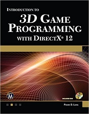

# EXERCISES: Introduction to 3D Game Programming with DirectX 12

## Synopsis

End of chapter exercises for the book: *Introduction to 3D Game Programming with DirectX 12* by Frank D. Luna.

 

Repo is originally forked from:
https://github.com/d3dcoder/d3d12book_2ed

Book website:
https://d3dcoder.net/d3d12.htm

### Table of Contents

Introduction
Part I Mathematical Prerequisites
* Chapter 1 Vector Algebra
* Chapter 2 Matrix Algebra
* Chapter 3 Transformations
Part II Direct3D Foundations
* Chapter 4 Direct3D Initialization
* Chapter 5 The Rendering Pipeline
* Chapter 6 Drawing in Direct3D
* Chapter 7 Drawing in Direct3D Part II
* Chapter 8 Lighting
  * [CHAPTER CODE AND EXERCISES 1-6](https://github.com/jamiejamiebobamie/DirectX_FromScratch/tree/lighting-demo)
* Chapter 9 Texturing
* Chapter 10 Blending
* Chapter 11 Stenciling
* Chapter 12 The Geometry Shader
* Chapter 13 The Compute Shader
* Chapter 14 The Tessellation Stages
Part III Topics
* Chapter 15 Building a First Person Camera and Dynamic Indexing
* Chapter 16 Instancing and Frustum Culling
  * [CHAPTER CODE](https://github.com/jamiejamiebobamie/DirectX_FromScratch/tree/instancing-and-culling-demo)
  * [EXERCISE 1](https://github.com/jamiejamiebobamie/DirectX_FromScratch/tree/instancing-ch16-ex1)
* Chapter 17 Picking
  * [CHAPTER CODE](https://github.com/jamiejamiebobamie/DirectX_FromScratch/tree/picking-demo)
  * [EXERCISE 1](https://github.com/jamiejamiebobamie/DirectX_FromScratch/tree/picking-ch17-ex1)
* Chapter 18 Cube Mapping
* Chapter 19 Normal Mapping
  * [CHAPTER CODE](https://github.com/jamiejamiebobamie/DirectX_FromScratch/tree/normal-map-demo)
  * [EXERCISE 1 AND 2](https://github.com/jamiejamiebobamie/DirectX_FromScratch/tree/normal-map-ex1-ex2)
  * [EXERCISE 4](https://github.com/jamiejamiebobamie/DirectX_FromScratch/tree/normal-map-ch19-ex4)
  * [EXERCISE 5](https://github.com/jamiejamiebobamie/DirectX_FromScratch/tree/normal-map-ch19-ex5)
* Chapter 20 Shadow Mapping
  * [CHAPTER CODE](https://github.com/jamiejamiebobamie/DirectX_FromScratch/tree/shadow-map-demo)
  * [EXERCISE 1](https://github.com/jamiejamiebobamie/DirectX_FromScratch/tree/shadow-map-ch20-ex1)
* Chapter 21 Ambient Occlusion
* Chapter 22 Quaternions
 * [CHAPTER CODE](https://github.com/jamiejamiebobamie/DirectX_FromScratch/tree/quat-demo)
* Chapter 23 Character Animation
Appendix A Introduction to Windows Programming
Appendix B High Level Shader Language Reference
Appendix C Some Analytic Geometry
Appendix D Selected Solutions

## Getting Started

* Clone the repo. 
* Open repo in Visual Studio.
* Navigate to the branch you wish to view.
* Click "Play" button to start solution.

### Prerequisites

* A 64-bit machine
* Windows 10 (or later)
* Visual Studio 2015 (or later)

## License

This project is licensed under the MIT License - see the [LICENSE.md](LICENSE.md) file for details

## Acknowledgments

* Luna, Frank D. Introduction to 3D Game Programming with DirectX 12. Mercury Learning and Information, 2016.

## Companion Study Tools

### Flashcard App
While going through the book, I created flash cards to remember the concepts and code.
You can find the raw JSON flash cards here:
* https://github.com/jamiejamiebobamie/flashcardApp/tree/master/src/SimulatedResponse/CardData/DirectX12

Feel free to clone the repo and use the app for your studies. The app has related topics such as Linear Algebra and Trigonometry.
* https://github.com/jamiejamiebobamie/flashcardApp
